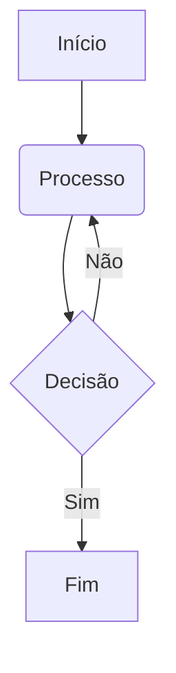

# Guia Rápido de Sintaxe Markdown

Markdown é uma linguagem de marcação simples e leve usada para formatar texto.

## 1. Títulos

Use `#` para títulos (nível 1 a 6).

```markdown
# Título 1

## Título 2

### Título 3
```

## 2. Ênfase

| Sintaxe                        | Resultado               |
| :----------------------------- | :---------------------- |
| `*itálico*` ou `_itálico_`     | _itálico_               |
| `**negrito**` ou `__negrito__` | **negrito**             |
| `***negrito e itálico***`      | **_negrito e itálico_** |

## 3. Listas

### Não Ordenadas

Use `*`, `-` ou `+`.

```markdown
- Item 1
- Item 2
  - Subitem 2.1
```

### Ordenadas

Use números seguidos de um ponto.

```markdown
1. Primeiro item
2. Segundo item
3. Terceiro item
```

## 4. Links

```markdown
[Texto do Link](URL)
```

## 5. Blocos de Código

Use três crases (```) para blocos de código. Adicione o nome da linguagem para syntax highlighting.

````markdown
```typescript
const nome = 'Manus';
console.log(nome);
```
````

## 6. Tabelas

Use pipes (`|`) e hífens (`-`).

```markdown
| Coluna 1 | Coluna 2 | Coluna 3 |
| :------- | :------: | -------: |
| Esquerda |  Centro  |  Direita |
| Dado 1   |  Dado 2  |   Dado 3 |
```

## 7. Citações (Blockquotes)

Use o sinal de maior que (`>`).

```markdown
> Esta é uma citação importante.
```

## 8. Diagramas (Mermaid)

O VitePress suporta diagramas Mermaid.

````markdown

````

Para dúvidas sobre a sintaxe, consulte a documentação oficial: [Sintaxe Markdown](https://www.markdownguide.org/)
