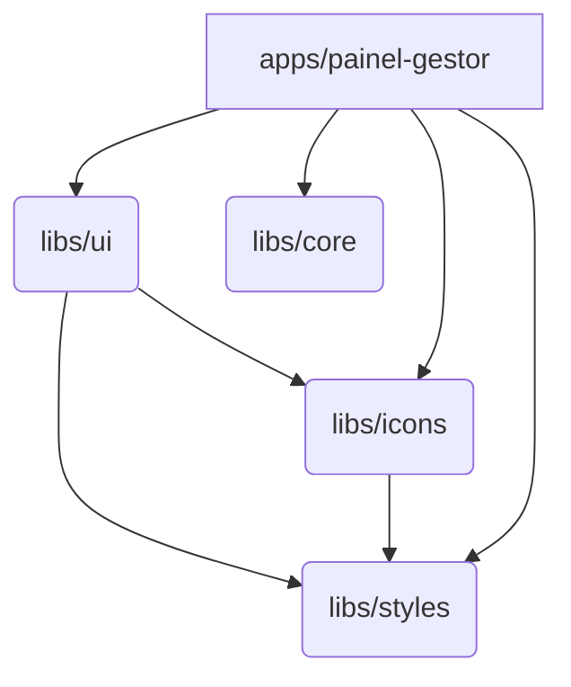

# Arquitetura: Visão Geral

A arquitetura frontend é o pilar de sustentação do nosso projeto, desenhada para garantir **escalabilidade, manutenibilidade e confiabilidade** a longo prazo.

## 1. Princípios Arquiteturais

Nossa arquitetura é regida por princípios de engenharia de software sólidos:

| Princípio                        | Descrição                                                                      | Benefício                                                     |
| :------------------------------- | :----------------------------------------------------------------------------- | :------------------------------------------------------------ |
| **Separation of Concerns (SoC)** | O código é estritamente dividido em camadas (`ui`, `core`, `styles`, `icons`). | Facilita a manutenção e o desenvolvimento paralelo.           |
| **Don't Repeat Yourself (DRY)**  | O código reutilizável é centralizado nas `libs`.                               | Reduz o tamanho do código e o risco de inconsistências.       |
| **Modularidade**                 | Cada funcionalidade é um módulo independente.                                  | Permite lazy loading e facilita a remoção/adição de features. |
| **Type Safety**                  | Uso obrigatório de TypeScript.                                                 | Elimina erros comuns em tempo de compilação.                  |

## 2. Estrutura de Monorepo (Nx + pnpm)

O monorepo é a escolha para gerenciar nossos múltiplos painéis e bibliotecas.

### 2.1. Vantagens do Monorepo

- **Reutilização de Código**: Fácil compartilhamento de `libs` entre `apps`.
- **Atomic Commits**: Mudanças em `libs` e `apps` relacionadas podem ser feitas em um único commit.
- **Cache Inteligente**: O Nx só re-builda ou re-testa o que foi **afetado** pela mudança.
- **Versão Única**: Todas as dependências externas são instaladas na raiz, garantindo que todos usem a mesma versão (evita o "dependency hell").

### 2.2. Fluxo de Dependência

As dependências seguem um fluxo estrito:



- **`apps`** **podem** depender de qualquer `lib`.
- **`libs`** **não podem** depender de `apps`.

Para visualizar a árvore de dependência do projeto, execute o comando abaixo:

```bash
pnpm nx graph
```

## 3. Fluxo de Dados e Gerenciamento de Estado

O projeto adota uma arquitetura de fluxo de dados clara:

1. **Componentes Vue**: Renderizam a UI.
2. **Pinia**: Gerencia o estado global (autenticação, preferências, filtros).
3. **`libs/core`**: Contém o `apiClient` (Axios wrapper) que faz a comunicação com o Backend.

## 4. Camadas de Código (Libs)

| Camada                | Lib      | Responsabilidade                                                                            |
| :-------------------- | :------- | :------------------------------------------------------------------------------------------ |
| **Apresentação**      | `ui`     | Componentes visuais.                                                                        |
| **Lógica de Negócio** | `core`   | Tipos TypeScript, funções puras (formatters, validators), wrappers de API, lógica complexa. |
| **Estilos**           | `styles` | Design Tokens e estrutura ITCSS.                                                            |
| **Ícones**            | `icons`  | Sistema de ícones unificado.                                                                |
